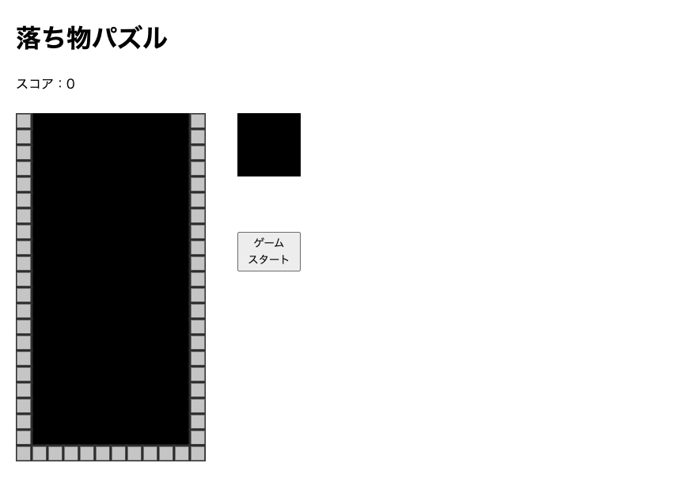

🌙 kids-javascript-study
====

## 📗 プロジェクトの概要

子供向けのjavascriptプログラミング教材です。

### 対象としている方
- プログラミングに興味がある小学生とその保護者の方
- これを機にプログラミングを学んでみたい人

## 📦 ディレクトリ構造

```
.
├── LICENSE
├── README.md
├── 第2章
│   ├── L06
│   ├── L07
│   ├── L08
│   ├── L09
│   ├── L10
│   ├── L11
│   └── L12
├── 第3章
│   ├── L13
│   ├── L14
│   ├── L15
│   ├── L16
│   └── L17
├── 第4章
│   ├── L18
│   ├── L19
│   ├── L20
│   └── L21
├── 第5章
│   ├── L22
│   ├── L23
│   └── L24
├── 第6章
│   ├── L25
│   ├── L26
│   ├── L27
│   ├── L28
│   ├── L29
│   ├── L30
│   ├── L31
│   └── L32
├── 第7章
│   ├── L33
│   ├── L34
│   ├── L35
│   ├── L36
│   ├── L37
│   ├── L38
│   ├── L39
│   └── 完成
└── 音声ファイル
    ├── don.mp3
    ├── gameover.mp3
    ├── kaiten.mp3
    ├── kieru.mp3
    ├── ochiru.mp3
    └── zenbu.mp3
```

## 🖊️ 学習の流れ

1. プログラミングの準備をしよう
1. プログラミングを始めよう
1. 画面を変更してみよう
1. 計算と変数、条件判定の使い方を知ろう
1. 繰り返し操作の基本を知ろう
1. 落ち物パズルを作ろう
1. 落ちものパズルを完成させよう

## 🔧 開発環境の構築

1. 「Visual Studio Code」をインストールします。
    1. https://azure.microsoft.com/ja-jp/products/visual-studio-code/
2. 「Visual Studio Code」を起動し「フォルダを開く」から本ディレクトリを読み込みます

## 🌐 Demo



## 💬 使い方

```

```

## 🎨 参考

| プロジェクト| 概要|
| :---------------------------------------| :-------------------------------|
| [できるキッズ 子どもと学ぶJavaScriptプログラミング入門](https://book.impress.co.jp/books/1118101044)| できるキッズ 子どもと学ぶJavaScriptプログラミング入門|


## 🎫 Licence

[MIT](https://github.com/isystk/laravel-react-boilerplate/blob/master/LICENSE)

## 👀 Author

[isystk](https://github.com/isystk)
